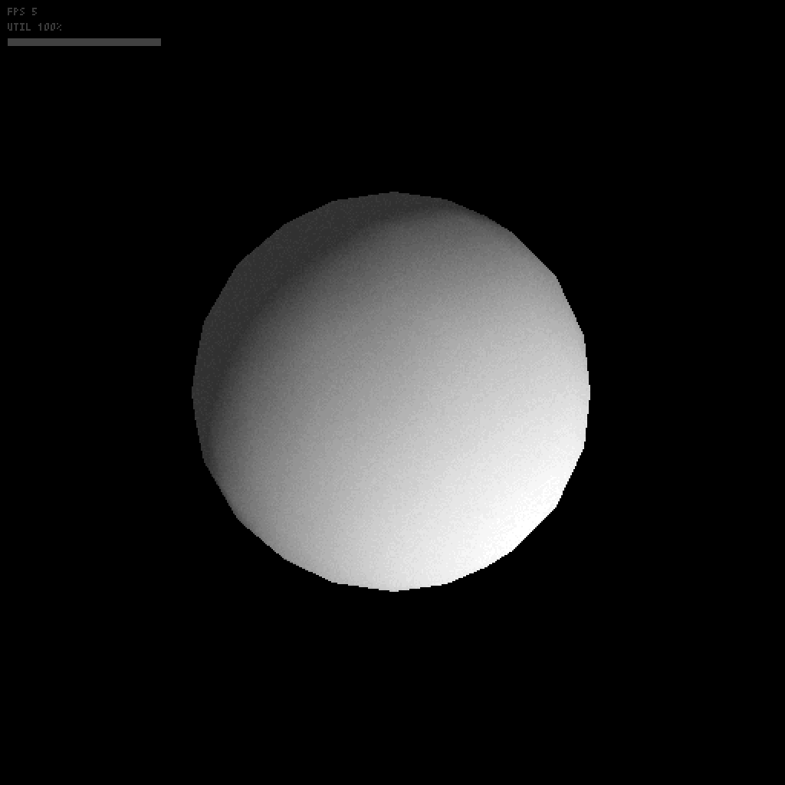

# Pyxel で 3D やってみる

Qiita記事 [【AI と一緒に作る 3D！】（Part 1）Pyxelでワイヤーフレームレンダリングを実装するまで](https://qiita.com/munepi0713/items/00b57ea650dfd45f0d42)、【AI と一緒に作る 3D！】（Part 2）Pyxelで多階調フォンレンダリングをする のコードです。

[遊んでみる](https://kitao.github.io/pyxel/wasm/launcher/?run=munepi0713.pyxel-3d.wireframe)

